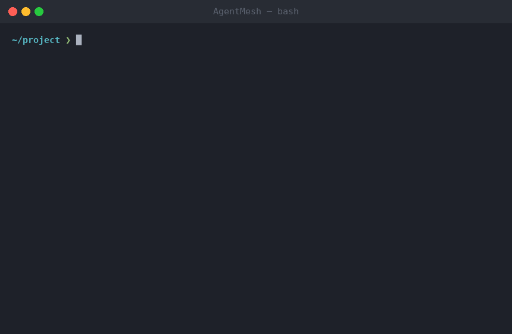

# AgentMesh

**Docker Compose for AI agents.** Define your AI agent team in YAML, run them with one command.

<p align="center">
  
</p>

---

## Why AgentMesh

You use multiple AI tools. A coding assistant. A PR reviewer. A monitoring bot. They don't talk to each other. AgentMesh lets you define a team of AI agents that share memory, communicate, and coordinate — running locally on your machine.

## Quick Start

```bash
npx agentmesh init
# edit mesh.yaml with your agents
npx agentmesh up
```

## 30-Second Example

Create a `mesh.yaml` with three agents that review code, deploy it, and monitor the result:

```yaml
version: "1"

defaults:
  model: claude-sonnet-4-6
  timeout: 120s
  retries: 3

memory:
  namespaces:
    - shared
    - deployments

mcp:
  github:
    command: npx
    args: ["-y", "@modelcontextprotocol/server-github"]
    env:
      GITHUB_TOKEN: $env.GITHUB_TOKEN

agents:
  reviewer:
    role: "Review pull requests for bugs, security issues, and style violations"
    model: claude-sonnet-4-6
    tools:
      mcp: [github]
    memory:
      read: [shared]
      write: [shared]

  deployer:
    role: "Deploy approved changes to staging and production"
    model: gpt-4o
    tools:
      mcp: [github]
      http:
        - name: deploy
          url: https://api.render.com/v1/deploys
          auth: Bearer $env.RENDER_TOKEN
    memory:
      read: [shared, deployments]
      write: [deployments]
    listen:
      - from: reviewer
        on: approved

  monitor:
    role: "Watch deployments and report failures"
    model: ollama/llama3
    tools:
      http:
        - name: healthcheck
          url: https://api.example.com/health
    memory:
      read: [deployments]
      write: [shared]
    listen:
      - from: deployer
        on: deployed
```

Run it:

```bash
npx agentmesh up
```

The reviewer analyzes PRs. When it approves, the deployer picks up the change. After deployment, the monitor starts watching. All three share state through memory namespaces.

## Features

- **YAML-first config** -- define agents like you define containers in Docker Compose
- **MCP-native** -- first-class support for Model Context Protocol servers, plus an HTTP escape hatch
- **Shared memory with namespace permissions** -- agents read and write to scoped namespaces
- **Agent-to-agent messaging** -- request/response and broadcast via `listen`/`on` directives
- **Local-first** -- runs on your machine, works with Ollama for fully offline operation
- **Pluggable** -- community agent templates, tool adapters, and memory backends
- **One command** -- `npx agentmesh up` starts everything
- **Model-agnostic** -- OpenAI, Anthropic, Ollama, Google — use whatever fits each agent

## CLI Commands

| Command              | Description                                      |
|----------------------|--------------------------------------------------|
| `agentmesh init`     | Scaffold a new `mesh.yaml` in the current directory |
| `agentmesh up`       | Start all agents defined in `mesh.yaml`          |
| `agentmesh validate` | Validate `mesh.yaml` against the schema          |
| `agentmesh doctor`   | Check environment: models reachable, env vars set, config valid |

## Plugin System

AgentMesh is extensible at every layer. Plugins are plain TypeScript modules.

### Agent Templates

```typescript
import { defineAgent } from "@agentmesh/core";

export default defineAgent({
  role: "Triage incoming GitHub issues by priority and label",
  defaultModel: "claude-sonnet-4-6",
  defaultTools: ["github"],
  systemPrompt: "You are an issue triage bot. Label issues as bug, feature, or question.",
});
```

### Tool Adapters

```typescript
import { defineTool } from "@agentmesh/core";

export default defineTool({
  name: "slack",
  description: "Send messages to Slack channels",
  auth: { type: "bearer", envVar: "SLACK_TOKEN" },
  tools: [
    {
      name: "send_message",
      description: "Post a message to a Slack channel",
      parameters: { channel: "string", text: "string" },
      handler: async (params) => {
        // call Slack API
      },
    },
  ],
});
```

### Memory Backends

```typescript
import { defineMemory } from "@agentmesh/core";

export default defineMemory({
  name: "redis",
  configSchema: { url: { type: "string", default: "redis://localhost:6379" } },
  connect: async (config) => { /* open connection */ },
  get: async (ns, key) => { /* read */ },
  set: async (ns, key, value) => { /* write */ },
  list: async (ns) => { /* list keys */ },
  clear: async (ns) => { /* flush namespace */ },
});
```

## Architecture

AgentMesh is built from six core components:

1. **Config Parser** -- reads `mesh.yaml`, validates against the JSON schema, resolves `$env.VAR` references.
2. **Memory Store** -- SQLite-backed key-value store with namespace isolation. Agents only access namespaces they are permitted to read or write.
3. **Message Bus** -- in-process pub/sub for agent-to-agent communication. Supports direct messages (`listen`/`on`) and broadcast.
4. **Model Router** -- dispatches prompts to the correct provider (OpenAI, Anthropic, Ollama, Google) based on the model string. Includes circuit breaker logic for fault tolerance.
5. **MCP Server Manager** -- spawns and manages MCP server processes, connects agents to their declared tools via stdio transport.
6. **Agent Supervisor** -- orchestrates the full lifecycle: starts workers, wires up memory and bus subscriptions, handles retries, and coordinates graceful shutdown.

## Contributing

1. Fork the repository
2. Create a feature branch: `git checkout -b my-feature`
3. Make your changes and add tests
4. Run the test suite: `pnpm test`
5. Submit a pull request

Please keep PRs focused on a single change. Include tests for new functionality.

## License

MIT
